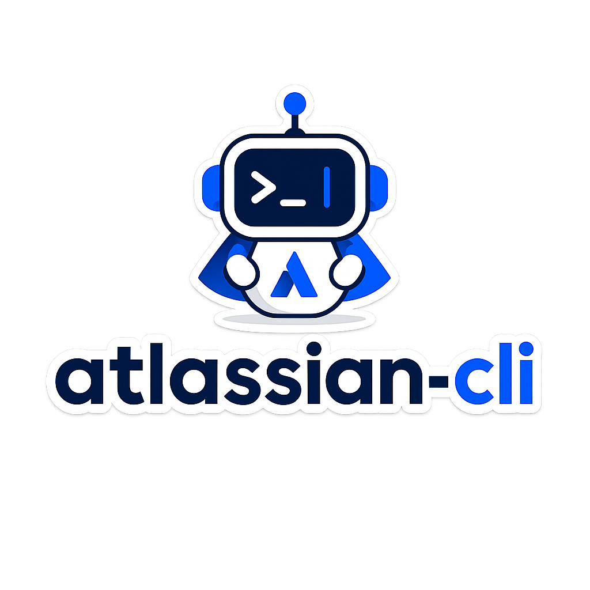

<p align="center">
  
</p>

# Atlassian CLI Workspace

> Provisional private workspace. Canonical binary family: `atl-*`.

This repository designs and implements true-to-API Atlassian CLIs:

- `atl-jira` for Jira
- `atl-conf` for Confluence
- `atl-bb` for Bitbucket Cloud

All three are implemented and share one command tree built in `internal/cli`.
The posture is inherited from `bb`, Auro's original Bitbucket Cloud CLI, with `atl-bb` as the unified-name successor: official API behavior first, deterministic targeting, structured output for agents, no fake parity when Atlassian does not expose a real API path.

## Current status

All three CLIs are implemented and merged to `main`. The shared foundation
(root command, global flags, output rendering, config, auth, the raw `api`
escape hatch, offline `resolve`/`browse`) plus the per-product surfaces below
are complete; see [docs/command-contract.md](docs/command-contract.md) for the
exact command behavior and known limitations.

- **`atl-jira`** — `project`, `issue` (view/list, create/edit/transition,
  `assign`/`watch`/`unwatch`/`watchers`, `link` + `link types`,
  `worklog` list/add, `attachment`, `comment` create/edit/delete),
  `field list`, `search issues` (JQL), and `status`.
- **`atl-conf`** — `space`, `page` (view/list/children/ancestors/versions plus
  create/edit/delete), `blogpost` (list/view/create/edit), `page comment`,
  `page label`, `attachment` (list/download/upload), `search` (CQL + text), and
  `status`. It is a mixed-version client (REST v2, with documented v1 fallbacks
  for CQL search, the current-user lookup, label writes, and attachment upload —
  see [ADR 0004](docs/adr/0004-mixed-version-confluence-client.md)).
- **`atl-bb`** — `repo` (incl. create/delete), `pr` (incl. approve/decline/merge),
  `pipeline` (incl. stop/steps/log), `issue` (incl. update), `workspace`,
  `project` (incl. delete), `commit`, `src`/`file`, `branch`, `tag`,
  `deployment`, `environment`, `search`, and `status`, with built-in
  git-checkout repository inference.

Destructive verbs (`repo delete`, `project delete`, `page delete`, …) require an
explicit `--yes` (see [ADR 0003](docs/adr/0003-destructive-verbs-require-yes.md)).

Shared across **every** binary: `version`, `auth`, `api`, `resolve`, `browse`,
plus `alias` (command shorthands) and `extension` (gh-style `<binary>-<name>`
external commands). Output is human-readable by default and verbatim API JSON
under `--json`/`--jq`; list/search commands take `--limit` and `--all`
(follow all pages); tokens are stored in the OS keychain (or a `0600`-mode
fallback file).

The phased build history (Phases 1–9 for the shared foundation and the
Jira/Confluence MVPs and depth, then B0–B3c for the Bitbucket rewrite) is
recorded in the archived phase plans under [docs/archive/](docs/archive/).

```bash
go test ./...
go run ./cmd/atl-jira project list --site work
go run ./cmd/atl-conf space list --site work
go run ./cmd/atl-conf search cql 'type = page' --site work
go run ./cmd/atl-conf page create --space DEV --title Notes \
  --body '<p>hi</p>' --body-format storage --site work
go run ./cmd/atl-jira issue view PROJ-1 --site work --jq '.fields.status.name'
go run ./cmd/atl-bb repo view acme/widgets --site work --json
```

To skip the repeated `--site`, set a default once with
`atl-jira auth default work` (or export `ATL_SITE=work`); the flag still wins
when given. Resolution order is `--site` → `ATL_SITE` → `default_site`.

See [docs/command-contract.md](docs/command-contract.md) for the implemented
command surface and known limitations, [docs/auth-runbook.md](docs/auth-runbook.md)
for end-to-end authentication setup, and [CONTRIBUTING.md](CONTRIBUTING.md)
for the development loop, PR workflow, and test-harness conventions.

## Install & build

### From a release

Each [release](https://github.com/aurokin/atlassian-cli/releases) attaches one
archive per platform bundling all three binaries, plus `checksums.txt`. Download
the archive for your OS/arch, verify it, and put the binaries on your `PATH` —
no Go toolchain needed. Step-by-step (with checksum verification) is in
[docs/consuming.md](docs/consuming.md#install).

### From source

From a clone of this repo (Go 1.26+):

```bash
make install              # go install all three binaries into $GOBIN
make build                # or: write ./bin/atl-jira, ./bin/atl-conf, ./bin/atl-bb
go install ./cmd/atl-jira # or one at a time
```

`make build` and `make install` stamp version metadata into each binary via
`-ldflags` (reported by `atl-* version`); override it with
`make build VERSION=1.2.0`. Run `make help` for the full target list
(`check`, `test`, `vet`, `fmt`, `lint`, `docs`, `clean`); `make check` is the
pre-merge gate (fmt-check + compile + vet + test).

The per-command Markdown reference is generated on demand (not committed) with
`make docs`, which wraps `go run ./cmd/gen-docs`.

> This is a private module. `go install <module>/cmd/atl-jira@latest` works
> only if your environment can fetch it (`GOPRIVATE` set plus repo access);
> from a local clone the commands above always work.

## Install agent skill

This repo also ships a reusable `atlassian-cli` skill for agents.

Install it from this repo with:

```bash
npx skills add https://github.com/aurokin/atlassian-cli --skill atlassian-cli
```

You can also inspect the skill directly in [skills/atlassian-cli](./skills/atlassian-cli).

Start here — the living docs:

1. [docs/README.md](docs/README.md) — documentation index
2. [docs/command-contract.md](docs/command-contract.md) — the implemented command surface
3. [docs/consuming.md](docs/consuming.md) — using the CLIs from scripts/agents: install, output/exit-code contract, pagination
4. [docs/auth-design.md](docs/auth-design.md) / [docs/auth-runbook.md](docs/auth-runbook.md) — auth model and setup
5. [docs/token-scopes.md](docs/token-scopes.md) — starter scope sets for scoped API tokens
6. [docs/access-error-model.md](docs/access-error-model.md) — structured errors and exit codes
7. [docs/shared-architecture.md](docs/shared-architecture.md) — how the three CLIs share a foundation
8. [docs/adr/](docs/adr/) — architecture decision records (the *why* behind standing choices)
9. [docs/releasing.md](docs/releasing.md) — how releases are cut; [docs/engineering-notes.md](docs/engineering-notes.md) — contributor conventions and gotchas
10. [docs/integration-testing.md](docs/integration-testing.md) — the live integration suite

The completed phase plans, MVP specs, and the Bitbucket-rewrite arc are kept as
historical records under [docs/archive/](docs/archive/).

## Guardrails

- Keep Jira, Confluence, and Bitbucket as separate CLIs from the user's perspective.
- Do not over-abstract; promote shared shapes only once implementation has proven the seam (as was done for `internal/restutil` and the shared `alias`/`extension` commands).
- Keep [docs/command-contract.md](docs/command-contract.md) current whenever a change alters command behavior.
- Never store real tokens, passwords, OAuth refresh tokens, cookies, or private credential files in this repo.
